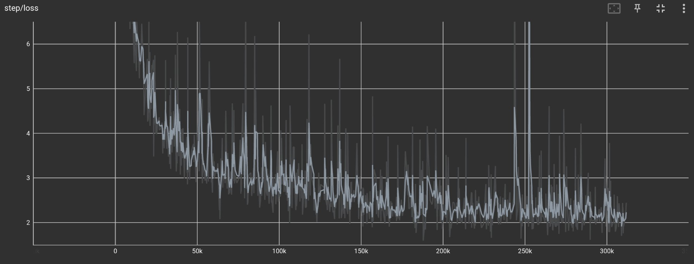
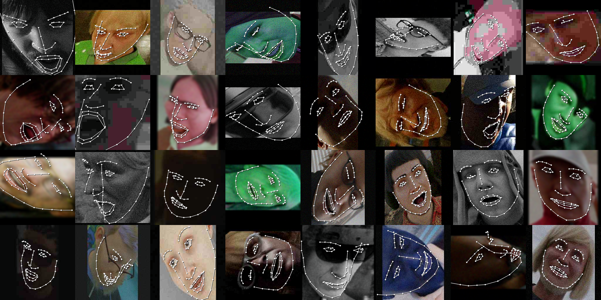
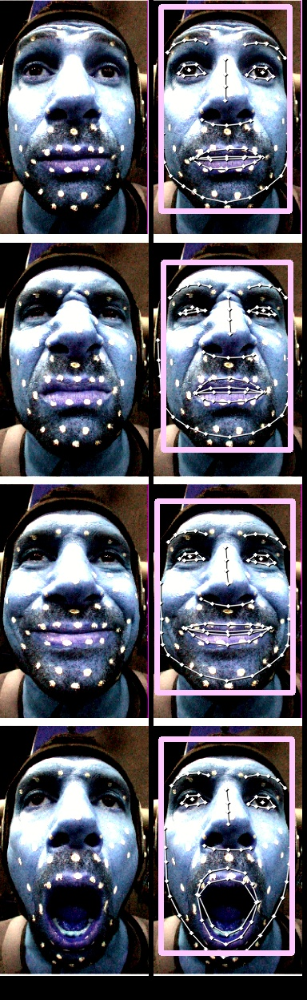

# HRNet-SynthFace
Microsoft사의 [SynthMoCap](https://github.com/microsoft/SynthMoCap) dataset 중 SynthFace dataset으로 학습한 Facial landmark detector입니다.

[HRNet](https://github.com/HRNet/HRNet-Image-Classification)부분의 코드는 [High-resolution networks (HRNets) for Image classification](https://github.com/HRNet/HRNet-Image-Classification) 코드 레포지토리에서 clone한 코드를 수정하여 사용하였습니다.

```yolov11n-face.pt``` 파일은 [yolo-face](https://github.com/akanametov/yolo-face) 에서 다운받은 파일입니다.

```Creating an Actor-specific Facial Rig from Performance Capture - 2947688.2947693.pdf.png``` 파일은 [Creating an Actor-specific Facial Rig from Performance Capture](https://dl.acm.org/doi/10.1145/2947688.2947693) 논문의 Fig. 3 에서 가져온 사진입니다.

위의 각각의 SynthMoCap dataset, yolo 파일 및 이미지들은 이 레포지토리의 MIT 라이센스가 아닌 고유의 라이센스가 적용됩니다. 주의해주시기 바랍니다...

# Requirements
실행에는 ```torch```, ```torchvision```, ```opencv(cv2)```, ```PyYAML```, ```yacs```, ```safetensors```, ```ultralytics``` 등 이 필요합니다. (```pred_roi.py```를 실행하면서 테스트해주세요... )
학습에는 추가로 ```accelerate```, ```tensorboard``` 가 필요합니다.

# Train
    accelerate launch --config_file=your_conf.conf main_softargmax_roi.py

# Prediction
    python pred_roi.py
    # or
    python pred_roi_cam.py
# Results
아래는 학습 결과입니다.
## loss

## GT

## Pred 

## Test
